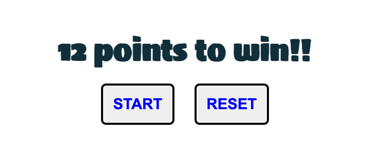

# Rock-Paper-Scissors-Lizard-Spock
Rock Paper Scissors Lizard Spock is a game developed to complete the Project portfolio 2 at Code institute. The game is played between the user and computer and each has a chance to win when either of them score 12 points. One can click on the "reset" button to begin the game again. The link to this fun game can be found [here](https://niraja85.github.io/Rock-Paper-Scissors-Lizard-Spock/).

## Features
### Site wide

* Navigation Menu
    * Contains links to Home page and Game page and is responsive on all screen sizes.
    * This will help the player navigate easily between the pages on all screen sizes.

    

* Favicon
    * A site wide Favicon will be implemented with a galaxy sign of rock paper scissor lizard spock game.
    * This will provide an image in the tabs header which in turn will help the users identify the page when they have several tabs opened.

   

### Home Page

* Diagramatic representation of the game rules
    * The game rules for which element dominates the othet is depicted in a diagram with the arrows pointing showing dominance.

   

* Game Rules
    * The Game rules and instructions to play the game are included in it.
    * The rules of dominance are written down so that the player has an idea of how points will be calulated.
    * Instructions on how to play the game is clearly mentioned.
    * A "Play" button is added to go to the game page.

 

* Play Game button
    * A button will be on the home page that when clicked will direct the user to the main game.
    * This will allow the user to start the game after they have read and understood how the game works.

  

### Game Page

* The game page shows the name of the game and displays that one needs to reach 12 points to win the game.
* There are two buttons, "Start" and "Reset" button respectively.
* To begin the game one must click on the start button, and choose any of the icons of rock, paper, scissors, lizard spock.
* If at any point the player wants to reset the game, he/she can click on the "reset" button and the score turns back to 0 for both, and new game can be started.

* Score-Board
    * The score-board is set at 0:0. 
    * Left side displays the "You" side, that is, the score of the player is displayed on the left side.
    * Right side displays theb "Computer" side, that is the score of the computer is displayed on the right side.
    * Each win increases the score by 1 point.
    * Clicking on the "Reset" button brings back the score-board to the starting level.

    

* Icons
    * The icons for Rock, paper, scissors, lizard and spock, are displayed in the form of hand and finger configurations.
    * The player can select any of the icons, and the icon selected gets highlighted.
    * The chosen icon is matched with that of the computer's choice.

    
    
* Message area
    * The box shows the message displayed based on game rules after comparing player and computer choices.
    * If its a draw the box coloe changes to blue, if player wins, the color is green, and if player loses, it#s color is red.
    * It also displays the message of winning or losing once either of the side has reached 12 points, and directs to click on "Reset" button to begin again.

    
 
 
 
 

 * Image Choice
     * There are two empty circles, where the left circle shows the image of the icon which the player chooses and the right circle shows the icon randomly chosen by the computer.

    

### Future features to implement
- Can be made more colorful.
- More features like confetti over the page while winning.
- Game sounds.

## Wireframes

* Home page 

* Game Page

## Technolgies

- HTML
  - The structure of the Website was developed using HTML as the main language.
- CSS
  - The Website was styled using custom CSS in an external file.
- JavaScript
  - The game play logic was created using JavaScript in an external file.
- Visual Studio Code
  - The website was developed using Visual Studio Code IDE
- GitHub
  - Source code is hosted on GitHub and delpoyed using Git Pages.
- Git
  - Used to commit and push code during the development of the Website
- Font Awesome
  - Icon obtained from https://fontawesome.com/ was used for GitHub Icon in the footer.
- Favicon.io
  - favicon files were created at https://favicon.io/favicon-converter/
- balsamiq
  - wireframes were created using balsamiq from https://balsamiq.com/wireframes/desktop/

